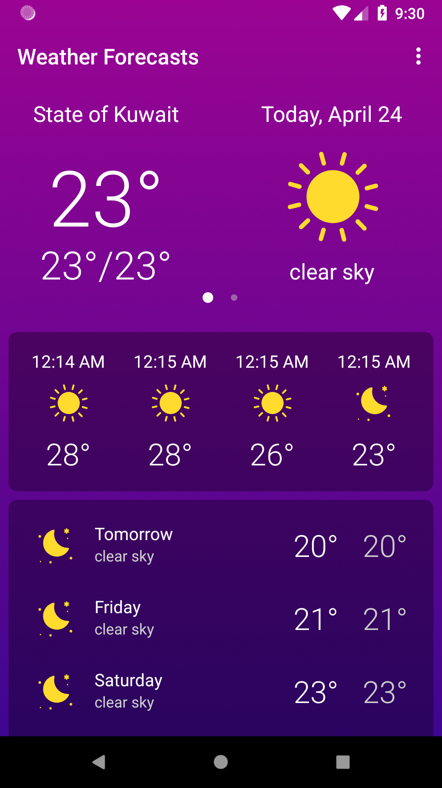

# Weather-Forecasts

## Overview

Weather-Forecasts is a modern Android application that provides users with real-time and forecasted weather data using the OpenWeatherMap API. The app is designed for performance, reliability, and a rich user experience, supporting offline data access, notifications, and background updates. Through a clean MVVM architecture, it ensures seamless updates and efficient data management.

---

## 📷 Screenshots

<p align="center">
  
  
  
  
  
  
</p>

---
## Features

- **Current Weather**: View up-to-date weather conditions for your chosen location.
- **5-Day Forecast**: Hourly and daily weather forecasts with detailed information.
- **Offline Support**: Weather data is cached locally using Room, allowing access without an internet connection.
- **User Preferences**: Change location, units (metric/imperial), and language through app settings.
- **Push Notifications**: Receive timely weather alerts and updates via the Android notification system.
- **Background Sync**: Automatic weather data refresh using WorkManager and custom scheduling utilities.
- **Responsive UI**: Live updates and efficient UI state management using LiveData and Data Binding.
- **MVVM Architecture**: Clean separation of concerns for maintainability and testability.

---

## Tech Stack

- **Programming Language**: Java
- **Architecture**: MVVM (Model-View-ViewModel)
- **Network**: Retrofit, Gson Converter
- **Local Storage**: Room (SQLite ORM)
- **Reactive Components**: LiveData, ViewModel, Data Binding
- **Background Processing**: WorkManager, custom executors (`AppExecutor`)
- **Notifications**: Android Notification framework
- **Preferences**: SharedPreferences (`SharedPreferenceHelper`)
- **API**: OpenWeatherMap
- **Other**: AndroidX, Data Binding, BroadcastReceiver for connectivity changes

---

## Getting Started

1. Clone the repository:
   ```sh
   git clone https://github.com/MohammedKhudair/Weather-Forecasts.git
   ```
2. Open with Android Studio.
3. Add your OpenWeatherMap API key in `res/values/strings.xml` (`api_key`).
4. Build and run on your device or emulator.

---

## License

[MIT License](LICENSE)


  

